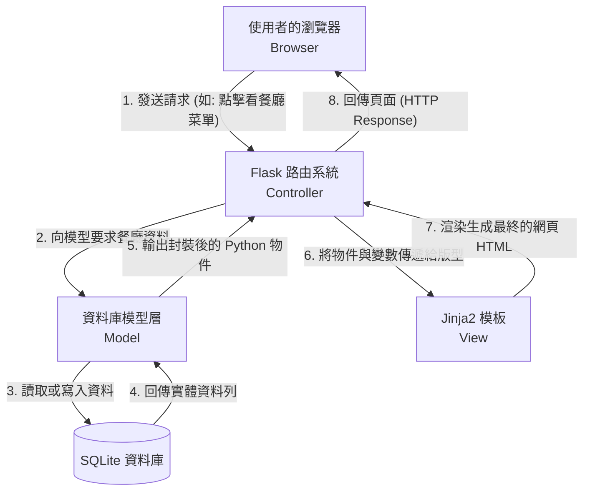

# 系統架構設計 - 校園美食推薦系統

## 1. 技術架構說明

### 選用技術與原因
- **後端框架：Python + Flask**
  - **原因**：Flask 是輕量級、易於學習且富有彈性的微框架（Micro-framework），非常適合中小型專案以及初學者的團隊協作開發。我們不需要過度龐大且複雜的工具包，透過 Flask 即可快速把核心系統搭建起來。
- **模板引擎：Jinja2**
  - **原因**：Jinja2 內建於 Flask 中，讓我們不需要額外學習或設定繁複的前端 JavaScript 框架。資料在後端運算完成後，能夠直接透過 HTML 模板渲染成動態的完整網頁，大幅簡化資料傳遞流程。
- **資料庫：SQLite**
  - **原因**：SQLite 不需要額外架設並啟動資料庫伺服器程序，所有的資料庫系統直接以一個單一檔案的形式存在專案內，方便管理、開發與備份。對於校園餐廳評價平台初步的資料量來說，效能已非常足夠。

### Flask MVC 模式說明
在這個專案中，我們實踐了標準的 MVC（Model-View-Controller）設計概念：
- **Model (模型)**：負責定義資料結構與資料庫通訊（包含 User、Restaurant、Review、Favorite 等實體資料表）。
- **View (視圖)**：負責呈現資料給使用者觀看與互動，由 Jinja2 配合 HTML/CSS 來呈現（例如餐廳列表頁、美食詳情頁），包含網站前台所有使用者看見的視覺介面。
- **Controller (控制器)**：負責應用程式邏輯與仲裁，也就是 Flask 的 `routes/` 路由功能負責的範疇。它會接收來自前端 View 的使用者瀏覽請求，呼叫 Model 向資料庫查詢或寫入資料，最後將結果夾帶回 View 生成畫面。

## 2. 專案資料夾結構

本專案將採用的資料夾結構如下，讓系統的維護與未來擴充可以有條不紊：

```text
web_app_development/
├── app/                      ← 專案的核心應用程式目錄
│   ├── __init__.py           ← 初始化 Flask App 與資料庫的工廠函數
│   ├── models/               ← 資料庫模型 (Model) - 與 SQLite 的溝通層
│   ├── routes/               ← Flask 路由 (Controller) - 包含登入、餐廳清單等業務邏輯
│   ├── templates/            ← HTML 模板 (View) - 使用 Jinja2 渲染的視圖層
│   └── static/               ← 前端靜態資源目錄
│       ├── css/              ← 全域或是個別頁面的樣式表
│       ├── js/               ← 前端互動邏輯 (如點擊星星評分、搜尋動態效果)
│       └── images/           ← 系統或餐廳上傳的圖片照片
├── instance/                 ← 放置系統執行時產生的機密與內部檔案 (會忽略 git commit)
│   └── database.db           ← SQLite 實體資料庫檔案
├── docs/                     ← 設計與開發說明文件庫 (PRD, 架構圖, 流程圖等)
├── config.py                 ← 系統內部應用程式的配置選項 (秘密金鑰等)
├── .gitignore                ← 設定 Git 提交時應忽略的檔案或目錄
├── requirements.txt          ← 專案需要的 Python 套件依賴清單
└── app.py                    ← 系統開啟與執行的主入口程式
```

## 3. 元件關係圖

以下展示了這套推薦系統中，各個技術元件之間的資料流向與伺服器架構設計：



## 4. 關鍵設計決策

1. **以 Server-Side Rendering (SSR) 為主，不採分離式 API 架構設計**
   - **原因**：考量到專題的開發時程，採用前後端分離（如 React + API）需要花費大量時間來回對接 API。使用 Flask 內建的 Jinja2 做 SSR，可以加速前後端的溝通，降低整體系統的複雜度與維護成本。

2. **採用統一工廠模式 (Application Factory) 建立 App**
   - **原因**：將 `app.py` 單純作為啟動入口，而在 `app/__init__.py` 內部實作 `create_app()` 工廠模式實例化 Flask。這有助於未來系統擴展、套用不同測試環境設定，也能有效避免 Python 常見的循環引入 (Circular Import) 問題。

3. **資料夾依賴職責切割 (MVC 分層)，而非功能切塊**
   - **原因**：我們將所有邏輯放進 `routes/`，所有版型放進 `templates/`。相較於將「使用者」與「餐廳」拆解成不同模組目錄（如 Blueprints 全功能打包），依賴職責的傳統 MVC 切割對初學者來說，更容易建立「找 HTML 去 Templates、找邏輯去 Routes」的直覺開發思維。

4. **將 `database.db` 統一存放於分離的 `instance/` 資料夾中**
   - **原因**：Flask 內建定義了 `instance` 這個資料夾來存放機敏或本地狀態。把會隨時間變動的資料庫檔案與主程式碼庫分開，並加入 `.gitignore` 排除，可確保學生註冊的資料不會被意外公開推送至 GitHub 上，引發資安與隱私外洩問題。
