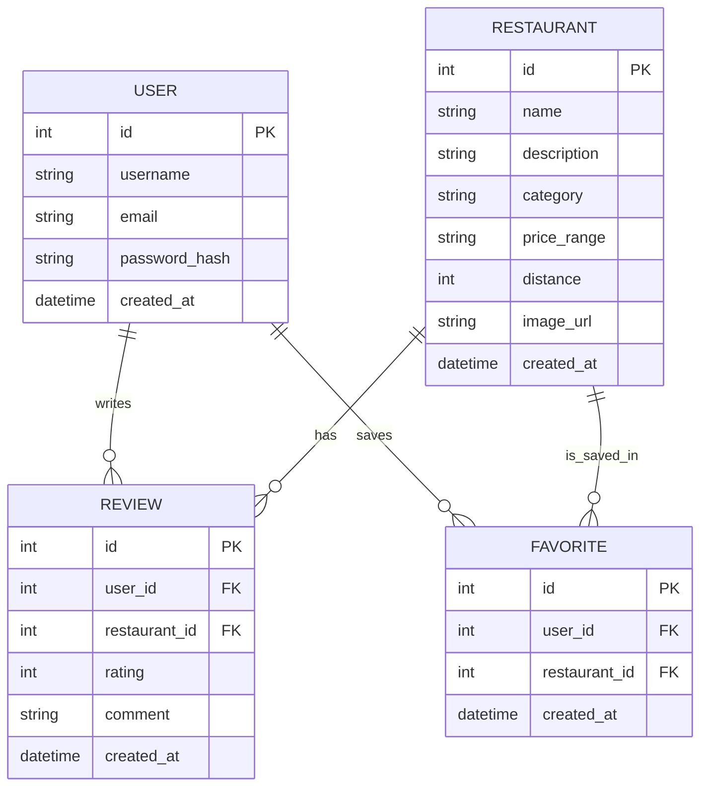

# 資料庫設計文件 (DB Design)

## 1. ER 圖 (實體關係圖)

## 2. 資料表詳細說明

### 2.1 `users` (使用者表)
紀錄學生的帳號與登入資訊。
- `id` (INTEGER): 主鍵，自動遞增。
- `username` (TEXT): 學生/使用者名稱，必填。
- `email` (TEXT): 註冊信箱，必填，唯一。
- `password_hash` (TEXT): 密碼的雜湊值，必填。
- `created_at` (DATETIME): 建立時間，預設為當前時間。

### 2.2 `restaurants` (餐廳表)
儲存校園周邊餐廳資料。
- `id` (INTEGER): 主鍵，自動遞增。
- `name` (TEXT): 餐廳名稱，必填。
- `description` (TEXT): 餐廳簡介。
- `category` (TEXT): 餐點類型 (如: 便當、麵食、飲料)。
- `price_range` (TEXT): 價格區間 (如: $, $$, $$$)。
- `distance` (INTEGER): 距離學校的評估值 (例如步行分鐘數或公尺計算)。
- `image_url` (TEXT): 餐廳圖片的 URL，用來呈現在列表與詳情中。
- `created_at` (DATETIME): 建立時間，預設為當前時間。

### 2.3 `reviews` (評論表)
儲存使用者對特定餐廳的評分與評論。
- `id` (INTEGER): 主鍵，自動遞增。
- `user_id` (INTEGER): 外鍵，關聯至 `users.id`，代表評論發布者。
- `restaurant_id` (INTEGER): 外鍵，關聯至 `restaurants.id`，代表對應的餐廳。
- `rating` (INTEGER): 星星評分 (1~5)，必填。
- `comment` (TEXT): 評論文字內容。
- `created_at` (DATETIME): 評論建立時間，預設為當前時間。

### 2.4 `favorites` (收藏表)
儲存使用者過往收藏的餐廳標記。
- `id` (INTEGER): 主鍵，自動遞增。
- `user_id` (INTEGER): 外鍵，關聯至 `users.id`。
- `restaurant_id` (INTEGER): 外鍵，關聯至 `restaurants.id`。
- `created_at` (DATETIME): 收藏加入的時間，預設為當前時間。
- **限制**: 同一個使用者對同一家餐廳只能有一筆收藏紀錄 (UNIQUE 約束)。

## 3. SQL 建表語法

位於 `database/schema.sql` 檔案中。包含建立以上四張資料表需要的 DDL 語法。

## 4. Python Model 程式碼

我們在 `app/models/` 產生了下列的模型設計，每個檔案均包含基本 CRUD 方法。
- `app/models/user.py`：管理使用者註冊與查詢
- `app/models/restaurant.py`：管理餐廳資料的取得與搜尋
- `app/models/review.py`：管理評價的新增與查詢
- `app/models/favorite.py`：管理使用者的收藏清單操作
