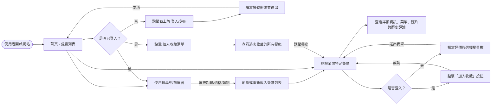
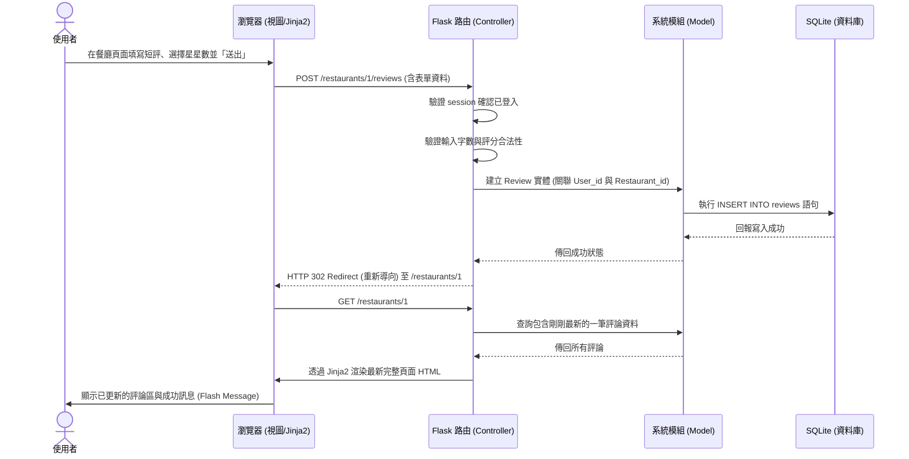

# 流程圖設計 - 校園美食推薦系統

以下文件根據系統的 PRD 與系統架構文件，視覺化呈現使用者的操作動線以及資料在系統內部的流動方式。

## 1. 使用者流程圖（User Flow）

此流程圖描述了從學生進入網站後，可以進行的各種動作與頁面跳轉邏輯。

## 2. 系統序列圖（Sequence Diagram）

此序列圖以核心功能 **「新增一則餐廳評論」** 為例，描述從使用者操作到資料庫寫入的完整交互過程。

## 3. 功能清單對照表

根據 PRD 定義的 MVP 功能，將其轉換為開發所需的路由路徑與 HTTP 請求方法規劃：

| 功能項目 | 對應 URL 路徑 (暫定) | HTTP 方法 | 說明 |
| --- | --- | --- | --- |
| **首頁 (餐廳列表)** | `/` 或 `/restaurants` | GET | 查詢並列出所有餐廳，或是推薦清單 |
| **關鍵字與條件篩選** | `/restaurants/search` | GET | 根據 `?q=` 或其他篩選條件 (距離/價格) 渲染結果 |
| **進階：會員註冊** | `/register` | GET, POST | GET: 顯示註冊表單 / POST: 處理密碼加密並新建帳號 |
| **進階：會員登入** | `/login` | GET, POST | GET: 顯示登入表單 / POST: 解析帳密並寫入 Session |
| **進階：會員登出** | `/logout` | GET, POST | 清除 Session 狀態並導回首頁 |
| **餐廳詳細資訊** | `/restaurants/<int:id>` | GET | 使用者點進特定餐廳，獲取詳細資訊與此店的歷史評論 |
| **新增評論與評分** | `/restaurants/<int:id>/reviews` | POST | 接收前端表單，將評論寫入資料庫並綁定外鍵關係 |
| **加入或移除收藏** | `/restaurants/<int:id>/favorite` | POST | 切換該使用者對於該餐廳的收藏狀態 |
| **個人專屬收藏頁** | `/favorites` | GET | 顯示目前使用者所有收藏的餐廳列表 |

